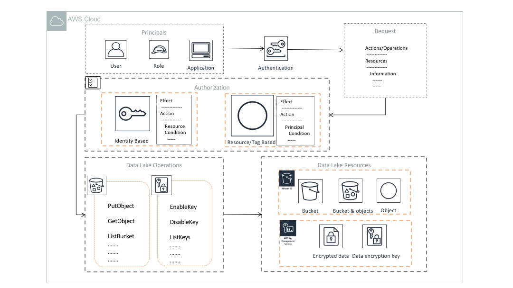

# AWS Datalake  Reference Architectures

## Overview

A [**data lake**](https://en.wikipedia.org/wiki/Data_lake) is a data repository that stores data in its raw format until it is used for analytics. It is designed to store massive amount of data at scale. A schema to the dataset in data lake is given as part of transformation while reading it. Below is a pictorial representation of a typical data lake on AWS cloud.

Data lakes are ideally designed with the following characteristics:

* **Schema-less**: They store structured, semi-structured and unstructured data in the same format as it is generated in the source systems. Such source systems can be SQL. NoSQL databases, audio/video files, log files or freeform text stored in  applications. It provides a way to describe any large data pool in which the schema and data requirements are not defined until the data is queried: “just in time” or “**schema on read**”
* **All data at one place:**  Data lakes are designed to store all data in one place.  They allow **collection of data **that you may or may not use for analytics.
* It stores unlimited amounts of data in any format **inexpensively.**
* **It complements enterprise data warehouse(EDW)** and is commonly a data source for the EDW – **capturing all but only passing relevant data to the EDW**
* Allows for data exploration without data model design and ingestion-**quick user access**

**NOTE: All contents in this reference achitecture documentation is developed prior to the general availability of [AWS Lake Formation](https://aws.amazon.com/lake-formation/). AWS Lake Formation specific contents would be added once it is available for production use.**

## S3 : A Storage Service for Datalake

[**Amazon S3**](https://aws.amazon.com/s3/) provides an optimal foundation for a data lake because of its virtually unlimited capacity and scalability. You can seamlessly increase your storage from gigabytes to petabytes without availability disruption and paying only for what you use. Amazon S3 is designed to provide 99.999999999% durability.

 It has **scalable performance, ease-of-use features, and native encryption and access control capabilities**. Amazon S3 integrates with a broad portfolio of AWS and third-party ISV data processing tools.

Key data lake-enabling features of Amazon S3 include the following:

* **Data security and data protection** – Data security in AWS is controlled by IAM. Fine grained access control on S3 objects can be defined by using IAM  users, roles and groups. Tagging can be used to manage access on group of objects.  S3 protects data by server side encryption(SSE) and Client side encryption (CSE) with KMS key or custom managed key. Data protection and security on S3 has been discussed in detail [here](src/data-security-and-protection)

* **Storage and compute is decoupled** – In traditional big data and data warehouse solutions, storage and compute are tightly coupled that limits its scalability. With Amazon S3, you can cost-effectively store data in read-optimized columnar formats like Parquet, ORC. You can then launch as many or as few virtual servers as you need using Amazon [Elastic Compute Cloud (EC2)](https://aws.amazon.com/ec2/) or [Elastic MapReduce (EMR)](https://aws.amazon.com/emr/). You can also use AWS analytics tools like [Amazon Athena](https://aws.amazon.com/athena/), [Amazon Redshift](https://aws.amazon.com/redshift/) or [AWS Glue](https://aws.amazon.com/glue/) to process/analyze your data. You can optimize your EC2/EMR instances to provide the right ratios of CPU, memory, and network bandwidth for best performance.
* **Centralized data architecture** – Amazon S3 makes it easy to build a multi-tenant environment, where many users can bring their own data analytic tools to a common set of data. This improves both cost and data governance over that of traditional solutions, which require multiple copies of data to be distributed across multiple processing platforms.
* **Integration with other AWS services** – Use Amazon S3 with [Amazon Athena](https://aws.amazon.com/athena/), [Amazon Redshift](https://aws.amazon.com/redshift/), [Amazon Rekognition](https://aws.amazon.com/rekognition/), [Amazon Transcribe](https://aws.amazon.com/transcribe/) and [AWS Glue](https://aws.amazon.com/glue/) etc. to analyze and process data. Amazon S3 also integrates with [AWS Lambda](https://aws.amazon.com/lambda/) serverless computing to run code without provisioning or managing servers. With all of these capabilities, you only pay for the actual amounts of data you process or for the compute time that you consume.
* **Standardized APIs** – [Amazon S3 RESTful APIs](https://docs.aws.amazon.com/AmazonS3/latest/API/Welcome.html) are simple, easy to use, and supported by most major third-party independent software vendors (ISVs), including leading [Apache Hadoop](https://hadoop.apache.org/) and analytics tool vendors. This allows customers to bring the tools they are most comfortable with and knowledgeable about to help them perform analytics on data in Amazon S3.

## Schema Management Architectures

The earliest challenges that inhibited building a data lake were keeping track of all of the raw assets as they were loaded into the data lake and then tracking all of the new data assets and versions that were created by data transformation, data processing, and analytics. Thus, an essential component of an Amazon S3-based data lake is a data catalog. The data catalog provides a query-able interface of all assets stored in the data lake’s S3 buckets. The data catalog is designed to provide a single source of truth about the contents of the data lake.

 There are two general forms of a data catalog:
 * Comprehensive [AWS Glue Catalog](https://docs.aws.amazon.com/glue/latest/dg/populate-data-catalog.html) commonly generated by crawling over the S3 datasets using AWS managed Glue crawler. A glue catalog contains information about data assets that have been transformed into formats and table definitions that are usable by analytics tools like Amazon Athena, Amazon Redshift, Amazon Redshift Spectrum, and Amazon EMR.
 * A Hive Metastore Catalog (HCatalog) managed and maintained by  user. We don't encourage user managed HCatalog dues to scalability challenges and compatibility issues with some AWS analytic tools.

### [Schema Management with AWS Glue Catalog](/src/working-with-schema)

<table><tr><td></td><td>AWS Glue Catalog is a metadata store to enable datalake schema evolution. Commonly, our customers use Glue crawler to crawl through the dataset and populate the catalog. Multiple AWS services can run query against the datalake through Glue catalog.</td></tr></table>

### [Data Security and Access Control Architectures](/src/data-security-and-protection)

<table><tr><td></td><td>Data security and data protection is considered to be of paramount importance for data governance in a datalake. AWS has a extensive set of services to secure data in S3. AWS IAM and AWS KMS are widely used to control access and protect content.</td></tr></table>

## Data Ingestion Architectures

One of the core values of a data lake is that it is a collection point and repository for all of an organization’s data assets, in whatever their native formats are. This enables quick ingestion, elimination of data duplication and data sprawl, and centralized governance and management. After the data assets are collected, they need to be transformed into normalized formats to be used by a variety of data analytics and processing tools.

 The key to ‘democratizing’ the data and making the data lake available to the widest number of users of varying skill sets and responsibilities is to transform data assets into a format that allows for efficient ad hoc SQL querying. As discussed earlier, when a data lake is built on AWS, we recommend transforming structured data assets into Parquet format. AWS provides multiple services to quickly and efficiently achieve this.

### [Using Kinesis Firehose and Kinesis Producer Library (KPL)](/src/data-ingestion/kinesis-firehose-and-kpl)
<table><tr><td></td><td>Amazon Kinesis is a massively scalable and durable real-time data streaming service. Amazon Kinesis Data Firehose is a fully managed service that delivers data in kinesis streams to target locations like S3. Kinesis firehose is commonly used to ingest data into S3 datalakes and automatically partition them by data arrival timestamp.</td></tr></table>

### [Ingestion Using AWS Glue](/src/data-ingestion/aws-glue)
<table><tr><td></td><td>AWS Glue is a fully managed ETL service that is commonly used to run batch ETL jobs. AWS Glue is the most preferred tool to ingest and transform data in a S3 datalake. This architecture is an example of data extraction from RDBMS sources like RDS, Aurora and ingestion into a datalake using AWS Glue.</td></tr></table>

### [Capture DB Changes with DMS (Database Migration Service)](/src/data-ingestion/dms-and-lambda)
<table><tr><td></td><td>CDC(Change data capture)  from relational databases are a very common dataset to be ingested in datalakes. DMS is a AWS managed CDC tool that's widely used to capture changes from databases. This architecture demonstrates how to use DMS and AWS Lambda to collect and partition dataset in a datalake.</td></tr></table>

### [Ingest Data from On-Premise NFS servers using AWS DataSync](/src/data-ingestion/aws-datasync-on-prem-nfs)
<table><tr><td></td><td>AWS DataSync is a fully managed data transfer service that simplifies, automates, and accelerates moving and replicating data between on-premises storage systems and AWS storage services over the internet or AWS Direct Connect. In this architecture we are leveraging AWS DataSync to ingest data into a datalake</td></tr></table>

## Data Analytic Architectures

S3 datalake efficiently decouples storage and compute. Hence, it is easy to build analytic platforms that scale out with increase in demand. To analyze data in datalake easily and efficiently, AWS has developed many managed and server-less big data services. Most commonly used services to run analytics on S3 data are: Elastic MapReduce (EMR), Redshift Spectrum, Athena, other 3rd party and open source services. Some common reference architectures are outlined below.

### Scale Out with Multiple EMR Clusters

Scaling out analytic workloads using multiple EMR clusters is a very common implementation by most of our customers. A frequent design pattern is to run Glue crawler on S3 data to define data schema in Glue catalog and use EMR clusters to read data from S3 using Glue Catalog.

In some cases, if customers already have data in S3  under multiple prefixes, it is hard for them to leverage Glue crawler to define one table for all similar schema. In such cases, customers may want to define their own data catalog in a hive metastore backed by an RDS database that stores custom schema definitions as defined by the users. All EMR clusters, may  refer to the same metastore to execute data analytics against S3.

#### [With Glue Catalog for Schema Management](/src/data-analytics/multi-emr-on-glue-catalog)
<table><tr><td></td><td>As explained earlier, S3 datalake decouples storage from compute. So, it  scales with analytic demand seamlessly by simply adding more compute without affecting availability. This architecture demonstrates how to architect an analytic solution with multiple EMR clusters to query S3 datalake via Glue catalog.</td></tr></table>

#### [With Hive Metastore on RDS for Schema Management](/src/data-analytics/multi-emr-on-hive-metastore)
<table><tr><td></td><td>Sometimes, datalake is built on top of existing data in S3 under multiple buckets and prefixes. So, it is difficult to generate catalog using Glue crawler. In such scenarios, customers may set up a Hive metastore using external RDS database and define custom schema for analytics using EMR.</td></tr></table>

### [AWS Athena on Glue Catalog](/src/data-analytics/amazon-athena)
<table><tr><td></td><td>Amazon Athena is a server-less query engine to query data in a S3 datalake. Athena uses Glue catalog as a schema repository that has mappings of the S3 datasets and its schema. This architecture provides insight on how to setup an analytic system using Amazon Athena.</td></tr></table>

### [Redshift Spectrum on Glue Catalog](/src/data-analytics/multi-emr-on-hive-metastore)
<table><tr><td></td><td>Amazon Redshift Spectrum is an AWS service to run queries against S3 datalake by leveraging the power of Amazon Redshift through external tables managed by Glue catalog. This architecture provides an end to end set up to query your datalake using Redshift spectrum and Glue catalog. </td></tr></table>
