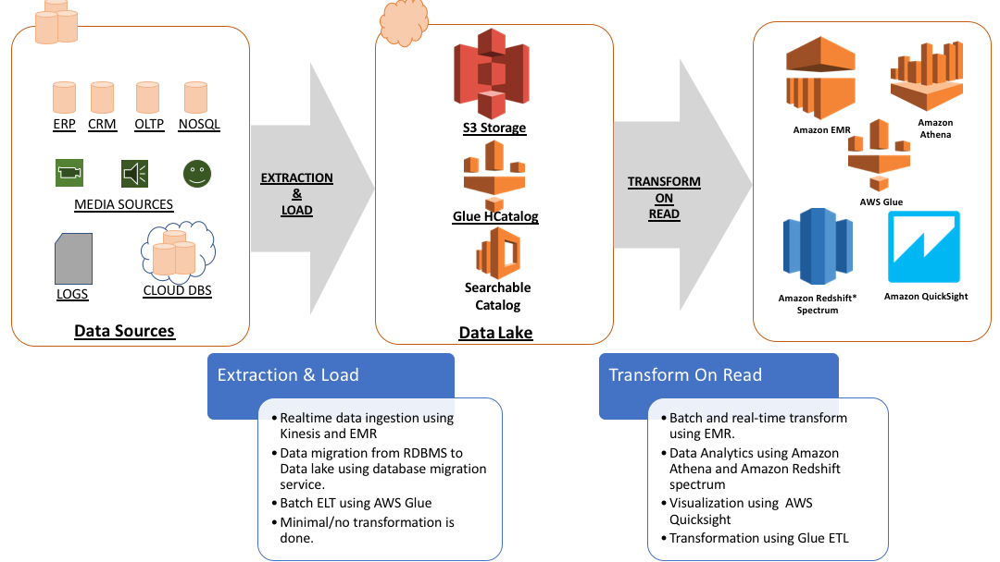
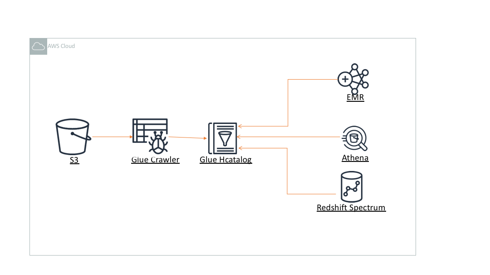
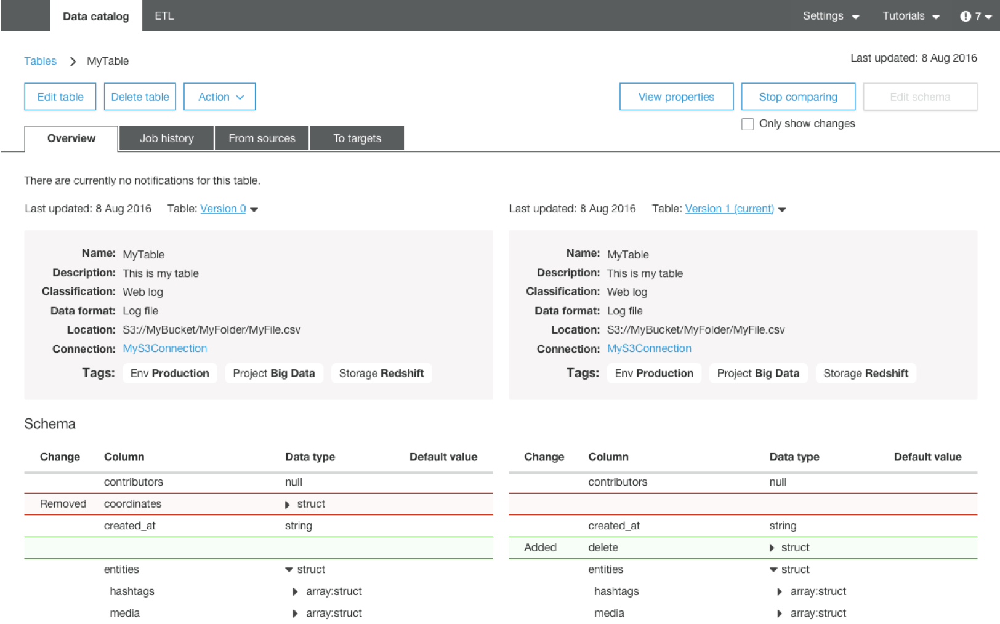
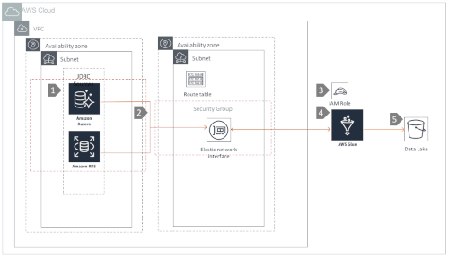
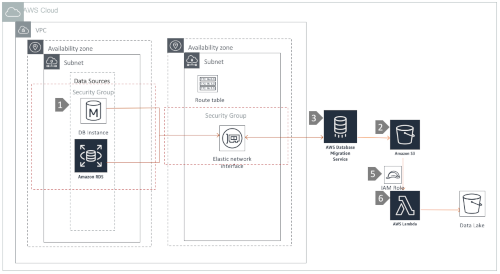
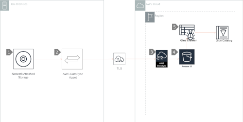
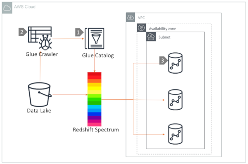

# AWS Datalake  Reference Architectures

## Overview

A [**datalake**](https://en.wikipedia.org/wiki/Data_lake) is a data repository that stores data in its raw format until it is used for analytics. It is designed to store massive amount of data at scale. A schema to the dataset in data lake is given as part of transformation while reading it. Below is a pictorial representation of a typical datalake on AWS cloud.

Data lakes are ideally designed with the following characteristics:

* [**Secure**](src/data-security-and-protection) – Datalakes must implement strong security to enable broad adoption across your business. Datalakes must implement strong [Identity](https://aws.amazon.com/iam) controls, enable Fine Grained Access to data, and support encrypting your data. 
* **Centralised:**  Data lakes are designed to store all data in one place, and enable the sharing of data across your Orgainsations or Business Units. Those business units may also have their own private Datalakes, but data should ultimately flow to a central source for sharing across the business.
* **Flexible:** Datalakes will capture data from any source system, including Relational and NoSQL databases, audio/video files, log files, freeform text, or any other type of data managed by your applications. They store structured, semi-structured and unstructured data in the same format as it is generated in the source systems, and provide a way to access data where the format and structure of the data are not defined until the data is queried: “just in time” or “**schema on read**”
* **Cost Effective:** Datalakes store a virtually unlimited amount of data in any format inexpensively, and provide you tooking to manage the data lifecycle for cost optimisation, as well as offering cost transparency.
* **An Analytics Ecosystem Foundation:** Datalakes are commonly a data source for an Enterprise Data Warehouse (EDW), that captures all your data but only passes on high value, conformed, and relevant data to the EDW.
* **Decoupled from Compute:** – In traditional big data and data warehouse solutions, storage and compute are tightly coupled in a way that can limit scalability. With a datalake, you store, secure, and index your data to enable data exploration by a virtually unlimited number of clients. These customers may run Big Data Ecosystem Tools on multiple [Amazon EMR](https://aws.amazon.com/emr/) clusters, run serverless queries with [Amazon Athena](https://aws.amazon.com/athena), [Amazon Redshift](https://aws.amazon.com/redshift) or [AWS Glue](https://aws.amazon.com/glue), or use legacy analytics tools on [Amazon Elastic Compute Cloud (EC2)](https://aws.amazon.com/ec2).
* **Integrated:** – Your datalake should enable exploration by virtually any analytical tool, and support access using common an open data formats and API's

_**Please NOTE**: All content in this reference achitecture has been developed prior to the general availability of [AWS Lake Formation](https://aws.amazon.com/lake-formation). AWS Lake Formation specific content will be added once it is available for production use, and in the meantime please see the [Datalake Solution](https://aws.amazon.com/answers/big-data/data-lake-solution) for a fully automated data lake that you can run as-is, or extend to meet your requirements_

## Designing your Datalake Storage Layer

<table><tr><td></td><td>Amazon S3 provides the ideal datalake storage foundation by offering a highly scalable, durable, and secure environment for any type of data. It is strongly integrated with identity services in IAM, encryption services from KMS, and both internal AWS as well as third-party analytic services natively integrate with its API's. Click <a href="src/storage-foundation">here</a> to learn more about best practices for the foundation storage architecture of a datalake in S3.</td></tr></table>

## Schema Management Architectures

Keeping track of all of the raw assets that are loaded into your datalake, and then tracking all of the new data assets and versions that are created by data transformation, data processing, and analytics can be a major challenge. An essential component of an Amazon S3 based data lake is a Data Catalog. A data catalog is designed to provide a single source of truth about the contents of the data lake, and rather than end users reasoning about storage buckets and prefixes, a data catalog lets them interact with more familiar structures of databases, tables, and partitions.

There are two general forms of a data catalog:

* Fully Managed: [AWS Glue Catalog](https://docs.aws.amazon.com/glue/latest/dg/populate-data-catalog.html) is a fully managed data catalog whose contents are generated by running crawlers over S3 datasets. The Glue Data Catalog contains information about data assets that have been transformed into formats and table definitions that are usable by analytics tools like Amazon Athena, Amazon Redshift, Amazon Redshift Spectrum, and Amazon EMR.
* End User Managed: A Hive Metastore Catalog (HCatalog) provides the ability to consume storage locations on Amazon S3 and on HDFS filesystems through the lanugage of databases and tables. However, it is managed and maintained by the operator of the AWS Account, and can be run through [Amazon EMR and Amazon RDS](https://docs.aws.amazon.com/emr/latest/ReleaseGuide/emr-metastore-external-hive.html). In most cases, AWS does not recommend user managed HCatalogs due to the requirement for you top operate it, as well as the need to scale the solution, and the lack of native integration with some AWS analytic tools.

Customers typically use the managed Glue Crawler to populate the catalog with the contents of Amazon S3. Then, multiple AWS services can run query the contents of the datalake via the Glue catalog.

### Schema Management with AWS Glue Catalog

AWS Glue Catalog can support datalake schema evolution, which means that it can understand the definition of a table over time, even when new columns and attributes are added. 

You can read more about dealing with schemas that change over time in the [Athena user guide](https://docs.aws.amazon.com/athena/latest/ug/handling-schema-updates-chapter.html).

### [Data Security and Access Control Architectures](src/data-security-and-protection)

<table><tr><td></td><td>Data security and data protection is of paramount importance for data governance in a datalake. AWS has a extensive set of services to secure data in S3. AWS IAM and AWS KMS are widely used to control access and protect content.</td></tr></table>

## Data Ingestion Architectures

One of the core values of a data lake is that it is a collection point and repository for all of an organizations data assets, in whatever their native formats are. This enables quick ingestion, elimination of data duplication and data sprawl, and centralized governance and management. After data assets are collected, they need to be transformed into normalized formats to be used by a variety of data analytics and processing tools. During this phase, customers will typically choose to standardise on a scheme for data compression, encryption of their data, and layout of information at the prefix level in S3.

The key to ‘democratizing’ data, and making it available to the widest number of users - of varying skill sets and responsibilities - is to transform data assets into a format that allows for efficient ad hoc SQL queries. As discussed earlier, when a data lake is built on AWS, we recommend transforming log-based data assets into Columnar formats. AWS provides multiple services to quickly and efficiently achieve this.

### [Using Kinesis Firehose and Kinesis Producer Library (KPL)](src/data-ingestion/kinesis-firehose-and-kpl)
<table><tr><td></td><td>Amazon Kinesis is a massively scalable and durable real-time data streaming service. Amazon Kinesis Data Firehose is a fully managed service that delivers data in kinesis streams to target locations like S3. Kinesis firehose is commonly used to ingest data into S3 datalakes and automatically partition them by data arrival timestamp.</td></tr></table>

### [File Ingestion Using AWS Glue](src/data-ingestion/aws-glue)
<table><tr><td></td><td>AWS Glue is a fully managed ETL service that is commonly used to run batch ETL jobs to transform data in your datalake. This architecture is an example of data extraction from data from RDBMS source and ingestion into a datalake using AWS Glue.</td></tr></table>

### [Capture Database Changes with the AWS Database Migration Service (DMS)](src/data-ingestion/dms-and-lambda)
<table><tr><td></td><td>CDC (Change data capture) from relational databases are important datasets that are very commonly ingested into datalakes. DMS is a CDC tool that's widely used to capture changes from a variety of database engines, and in this architecture we demonstrate how to use DMS and AWS Lambda to collect and partition database data in a datalake.</td></tr></table>

### [Ingest Data from On-Premise NFS servers using AWS DataSync](src/data-ingestion/aws-datasync-on-prem-nfs)
<table><tr><td></td><td>AWS DataSync is a fully managed data transfer service that simplifies, automates, and accelerates moving and replicating data between on-premises storage systems and AWS storage services over the internet or AWS Direct Connect.</td></tr></table>

## Data Analytic Architectures

An S3 datalake efficiently decouples storage and compute, which makes it is easy to build analytics applications that scale out with increases in demand. To analyze data in your datalake easily and efficiently, AWS has developed several managed and serverless big data services. The most commonly used services to run analytics on S3 data are: Amazon Athena, Redshift Spectrum, Amazon EMR, as well as other 3rd party and open source services. Some common reference architectures are outlined below.

### [AWS Athena on Glue Catalog](/src/data-analytics/amazon-athena)
<table><tr><td></td><td>Amazon Athena is a serverless query engine to query data in a S3 datalake. Athena uses the Glue Catalog as its schema repository by default. This architecture provides insight on how to setup an analytics system using Amazon Athena.</td></tr></table>

### [Redshift Spectrum on Glue Catalog](/src/data-analytics/multi-emr-on-hive-metastore)
<table><tr><td></td><td>Amazon Redshift Spectrum is an AWS service to run queries against S3 datalake by leveraging the power of Amazon Redshift through external tables managed by Glue catalog. This architecture provides an end-to-end setup to query your datalake using Redshift Spectrum and Glue catalog. </td></tr></table>

### Scaling Out with Multiple EMR Clusters

Scaling out analytics workloads using multiple EMR clusters is a common model for many of our customers. A frequent design pattern is to run the Glue Crawler on S3 data to define data schema in Glue Catalog, and then use EMR clusters to use tools such as Spark, Hive and Presto to query the data.

In some cases, customers may want to define their own data catalog in a Hive metastore, backed by a highly available RDS database. This solution offers extended and custom schema definitions defined by end users, support for Hive Thrift Server, and the ability to customise the Hive software stack being used to support the metastore. Whether self or fully managed, all your EMR clusters can refer to the same metastore to execute data analytics against S3.

#### [With Glue Catalog for Schema Management](/src/data-analytics/multi-emr-on-glue-catalog)
<table><tr><td></td><td>This architecture demonstrates how to architect an analytics solution with multiple EMR clusters to query S3 datalake via Glue Catalog.</td></tr></table>

#### [With Hive Metastore on RDS for Schema Management](/src/data-analytics/multi-emr-on-hive-metastore)
<table><tr><td></td><td>In this architecture, we show you how to build your own Metastore using EMR and Amazon RDS, and then leverage that platform from other analytics tools</td></tr></table>
