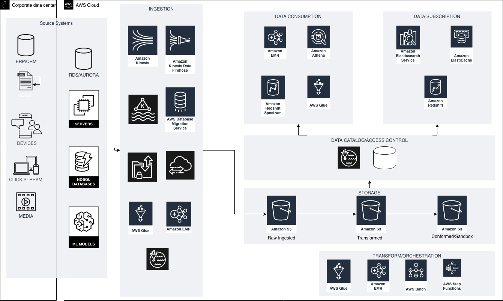

> # Due to repeated requests from users for a better interface. This content has been moved to GitBooks. Please visit https://aws-reference-architectures.gitbook.io/datalake/ for updated architecture. This github repository shall be refreshed periodically. 

---
description: >-
  This page provides an overview of what is a datalake and provides a highlevel
  blueprint of datalake on AWS.
---

# Overview of a Datalake an AWS

## Datalake Overview

A [**datalake**](https://en.wikipedia.org/wiki/Data_lake) is a data repository that stores data in its raw format until it is used for analytics. It is designed to store massive amount of data at scale. A schema to the dataset in data lake is given as part of transformation while reading it. Below is a pictorial representation of a typical datalake on AWS cloud.

Data lakes are ideally designed with the following characteristics:

* [**Secure**](https://en.wikipedia.org/wiki/Data_security) – Datalakes must implement strong security to enable broad adoption across your business. Datalakes must implement strong [Identity](https://aws.amazon.com/iam) controls, enable Fine Grained Access to data, and support encrypting your data. 
* **Centralized:**  Data lakes are designed to store all data in one place, and enable the sharing of data across your Orgainsations or Business Units. Those business units may also have their own private Datalakes, but data should ultimately flow to a central source for sharing across the business.
* **Flexible:** Datalakes will capture data from any source system, including Relational and NoSQL databases, audio/video files, log files, freeform text, or any other type of data managed by your applications. They store structured, semi-structured and unstructured data in the same format as it is generated in the source systems, and provide a way to access data where the format and structure of the data are not defined until the data is queried: “just in time” or “**schema on read**”
* **Cost Effective:** Datalakes store a virtually unlimited amount of data in any format inexpensively, and provide you tooking to manage the data lifecycle for cost optimisation, as well as offering cost transparency.
* **An Analytics Ecosystem Foundation:** Datalakes are commonly a data source for an Enterprise Data Warehouse \(EDW\), that captures all your data but only passes on high value, conformed, and relevant data to the EDW.
* **Decoupled from Compute:** – In traditional big data and data warehouse solutions, storage and compute are tightly coupled in a way that can limit scalability. With a datalake, you store, secure, and index your data to enable data exploration by a virtually unlimited number of clients. These customers may run Big Data Ecosystem Tools on multiple [Amazon EMR](https://aws.amazon.com/emr/) clusters, run serverless queries with [Amazon Athena](https://aws.amazon.com/athena), [Amazon Redshift](https://aws.amazon.com/redshift) or [AWS Glue](https://aws.amazon.com/glue), or use legacy analytics tools on [Amazon Elastic Compute Cloud \(EC2\)](https://aws.amazon.com/ec2).
* **Integrated:** – Your datalake should enable exploration by virtually any analytical tool, and support access using common an open data formats and API's

