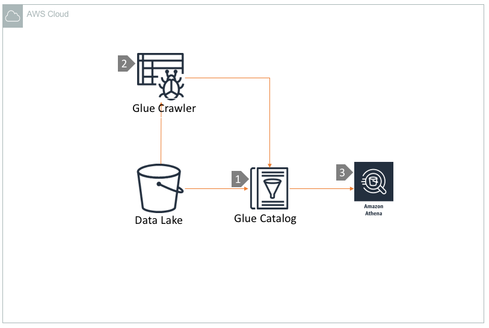

# Query S3 Data lake using Athena and Glue Catalog

## Overview

[Amazon Athena](https://aws.amazon.com/athena/) is a serverless interactive query service that makes it easy to analyze data in Amazon S3 using standard SQL. Athena is out-of-the-box integrated with AWS Glue Data Catalog, which makes it very fast and easy to start running queries against your datalake. This is one of the simplest data lake architectures, as Amazon Athena is natively integrated with S3 data through the [AWS Glue Catalog](https://aws.amazon.com/glue/). [Glue Crawlers](https://docs.aws.amazon.com/glue/latest/dg/add-crawler.html) can be optionally used to create and maintain the data catalog.

## Architecture Component Walkthrough

1. AWS Glue Catalog stores schema and partition metadata of datasets residing in S3 datalake.
2. Amazon Glue Crawler can be \(optionally\) used to create and update the data catalogs periodically. If you know the schema of your data, you may want to use Athena to define tables directly in the Glue catalog using Hive DDL syntax.
3. Athena uses the Glue Data Catalog to extract schema definitions by default, which are then used to format and query data on S3. Wherever possible, it is recommended to use data partitioning, compression,  columnar serialization formats in S3 for better query performance.

## References

* [Athena Best Practices](https://aws.amazon.com/blogs/big-data/top-10-performance-tuning-tips-for-amazon-athena/)

