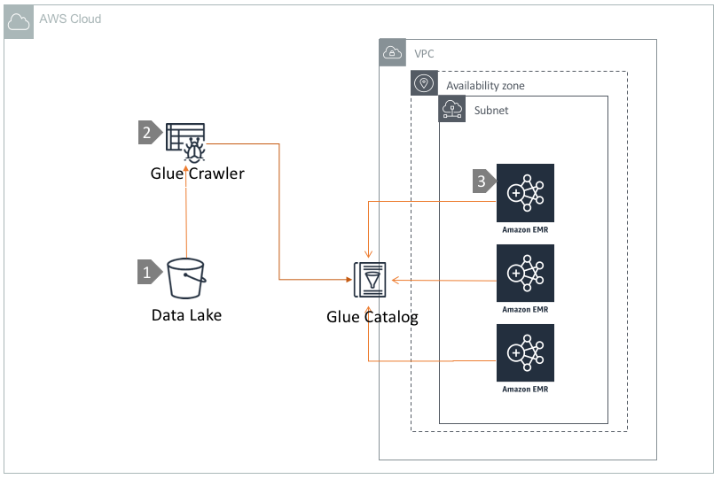

# Query Data lake using EMR and Glue Catalog

## Overview

[Amazon EMR](https://aws.amazon.com/emr/) provides a managed Hadoop framework that makes it easy, fast, and cost-effective to process vast amounts of data across dynamically scalable Amazon EC2 instances. You can also run other popular distributed frameworks such as Apache Spark, HBase, Presto, and Flink in EMR, and interact with data in other AWS data stores such as Amazon S3 and Amazon DynamoDB. EMR Notebooks, based on the popular Jupyter Notebook, provide a development and collaboration environment for ad hoc querying and exploratory analysis.

In a datalake environment, it is essential to have a central schema repository of the datasets available in S3. [AWS Glue](https://aws.amazon.com/glue/) Data Catalog provides a fully managed service for indexing and managing the schema of data stored in S3. Compute engines like EMR, Athena, Redshift etc can execute analytics workloads against your S3 datalake using the Glue Data Catalog by default.

In this architecture, we show how to leverage AWS Glue Data Catalog to execute queries against S3 datalake by using multiple EMR clusters in [virtual private cloud \(VPC\)](https://aws.amazon.com/vpc/).

## Architecture  Walkthrough

1. S3 datalake is populated by one or many data ingestion mechanism.
2. Glue Crawlers are used to discover datasets in S3 and create and maintain the schema definitions in the Glue Data Catalog.
3. Multiple EMR clusters can be deployed with access to Glue Catalog. EMR clusters execute queries against  S3 through an [Internet Gateway](https://docs.aws.amazon.com/vpc/latest/userguide/VPC_Internet_Gateway.html) or [S3 Endpoint](https://docs.aws.amazon.com/vpc/latest/userguide/vpc-endpoints-s3.html) in the VPC.

## References

* [Use Glue Catalog as Metastore](https://docs.aws.amazon.com/emr/latest/ReleaseGuide/emr-hive-metastore-glue.html)

