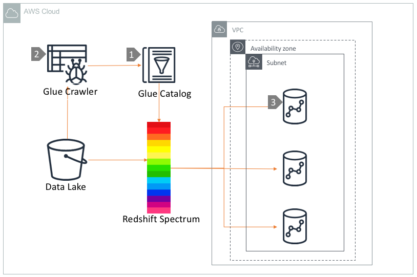

# Query Data lake using Redshift Spectrum and Glue Catalog

## Overview

[Amazon Redshift](https://aws.amazon.com/redshift/) Spectrum is a massively parallel query engine that can run queries against your S3 datalake through 'external tables', without loading data into your Redshift cluster.

Spectrum is integrated with AWS Glue Data Catalog. The Spectrum external table definitions are stored in Glue Catalog and accessible to the Redshift cluster through an 'external schema'. In this reference architecture, we are going to explain how to leverage Amazon Redshift Spectrum to query S3 data through a Redshift cluster in a VPC.

## Architecture Component Walkthrough

1. AWS Glue Catalog that stores schema and partition metadata of datasets residing in your S3 data lake.
2. Amazon Glue Crawler can be \(optionally\) used to create and update the data catalogs periodically. If you know the schema of your data, you may want to use any Redshift client to define Redshift external tables directly in the Glue catalog using Redshift client.
3. [Create an 'external schema'](https://docs.aws.amazon.com/redshift/latest/dg/c-spectrum-external-schemas.html) in your Redshift cluster, which links the database cluster schema name to an AWS Glue Data Catalog Database
4. You can then query your data in S3 using Redshift Spectrum via a S3 VPC endpoint in the same VPC. Redshift Spectrum uses the schema and partition definitions stored in Glue catalog to query S3 data. [AWS recommends](https://aws.amazon.com/blogs/big-data/10-best-practices-for-amazon-redshift-spectrum/) using compressed columnar formats such as Orc and Parquet for better query performance.

