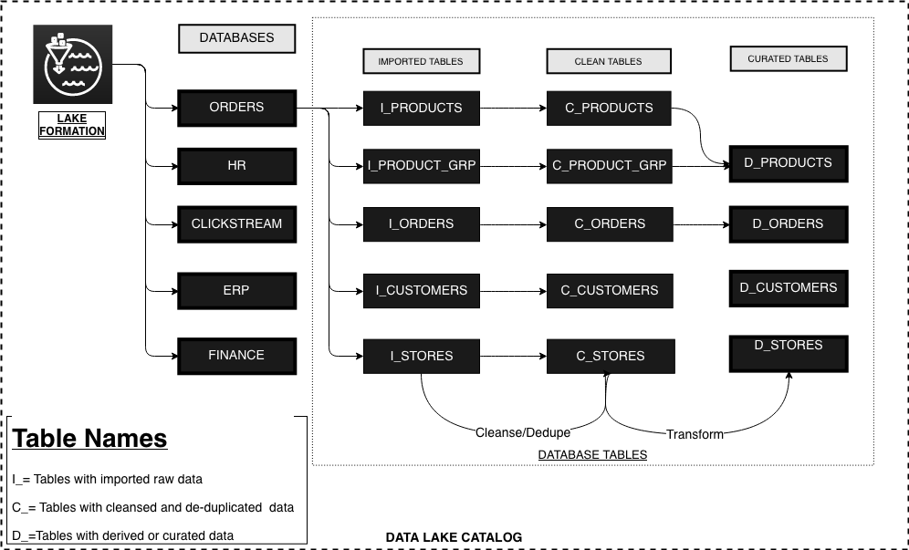

# Data Catalog Architecture

## Overview

Customers often store their data in S3 wither in one or many S3 buckets across one or many AWS accounts. When your data with different format is stored at different S3 locations it becomes difficult to  manage metadata, schema and access. It is important for many organizations to build a central data catalog that makes it easy for users to discover datasets, enrich them with metadata and control access. 

Building a data lake catalog for an organization is a difficult task. AWS Lake Formation makes it easy to set up a secure data lake. Creating a data lake catalog with Lake Formation is simple as it provides  user interface and APIs for creating and managing a data . In the next section, we are sharing the best practices  of creating an organization wide data catalog using [AWS Lake Formation](https://aws.amazon.com/lake-formation/).

## Best practices for designing your Data lake Catalog

The challenges that inhibited building a data lake were keeping track of all  raw assets as they were ingested into S3 and then new data assets and versions that were created by data transformation, data processing, and analytics. So, it became essential to register assets at a single location to easily discover assets, manage metadata and define consistent access control policies for all its consumers. The AWS LakeFormation catalog provides a query-able interface of all assets stored in the data lake’s S3 buckets. 

### AWS Lake Formation Definitions

* **Region**: Amazon cloud computing resources are hosted in multiple locations world-wide. These locations are composed of AWS [Regions](https://docs.aws.amazon.com/AmazonRDS/latest/UserGuide/Concepts.RegionsAndAvailabilityZones.html) and Availability Zones. Each AWS Region is a separate geographic area. Each AWS Region has multiple, isolated locations known as Availability Zones.
* **Data Lake**:  A data lake in AWS Lakeformation is a schematic and organized representation of your registered corporate data assets stored in Amazon S3 in the form of databases, tables and columns. 
* **Blueprint**:  AWS Lake formation blueprint is a data ingestion template designed to easily ingest un-transformed data from various data sources like relational dbs\(JDBC\), load balancer logs etc into Amazon S3 to build a datalake. 
* **Data catalog**:  A data catalog  contains information about all assets that have been ingested into or curated in the S3 data lake. It is designed to provide an interface for easy discovery of data assets,  security control and to provide a single source of truth for the contents of a data lake.
  * **User**: An user is a persona who performs an activity on a data lake like creating data assets, provide access to other users etc.
  * **Database:** A database is a namespace withing a data catalog  the catalog metadata resides. 
  * **Table:** A table is a schema representation of a data asset registered in AWS LakeFormation**.**
  * **Column:** A column represents a data attribute and its properties \(like name,datatype, metadata etc\) of a table.

### How many data catalogs do I need?

Number of catalogs that you need for your corporate is entirely dependent on your use case and analytics culture. However, we highly recommend our customers to build a single data catalog on top of their S3 data lake to avoid data silos, ensure single source of truth and provide users with a single interface for data discovery and metadata management. 

It is possible that customers might have a huge amount of data already stored in S3 in different AWS accounts. You create a single data catalog in one AWS account irrespective of where your data sits. For ease of data discovery, customers may want to organize their data subjects in different **databases** within the same data catalog.  For setting up a single lake formation data catalog with data in different S3 buckets across different AWS accounts, please refer to the blog [here](https://aws.amazon.com/blogs/big-data/access-and-manage-data-from-multiple-accounts-from-a-central-aws-lake-formation-account/).

### How do I organize my data catalog?

The success of your data lake journey is based on the success of how people use the data catalog. Therefore, a thoughtful approach to organize your data lake will go a long way. Datalake is not a system of record, it is stores data that's generated elsewhere. In many organizations, people look for datasets based on the system of records such as HR, ERP,  CRM, Ordering, Clickstream etc.  Similarly, it is a common pattern for prople to look for  datasets by their transformation lifecycle stage within the data lake such as raw, curated and conformed. So, it is always a good idea to define a design convention that's easy and self-explanatory. 

* **Organize catalog databases by source of data**

Many of our customers use separate databases to store data generated from different source systems. This makes it easy for users to  search datasets by source source systems. The primary reason for this design pattern are: 

* It makes it easier for data consumers to discover data by source of the data 
* Related datasets are colocated in the database.
* Easy to enforce security controls on similar datasets.
* Single threaded but decentralized ownership model can be easily implemented.
* Drives faster adoption due to no cross-functional dependency

\*\*\*\*

* **Name tables in same database with life-cycle stage of data within the lake**

As the data is ingested in the datalake, it goes through multiple stages of transformation lifecycle. Each stage has a different format and shape. It's always recommended to define  naming conventions within a database that unambiguously segregates the life cycle stage of same data. Please refer to the diagram below for a sample naming convention. Customers are advised to choose naming convention that suits to their business and customer needs.

* **Managing conformed data and user spaces within the catalog.**

 Often, businesses get similar datasets from more than one sources. For example, a customer for a large business can come from many ERP systems, CRMs or any specific app that stores customer information. When similar datasets flow into the lake from many sources, it becomes important to transform, conform and create a single source and version of truth for the enterprise. Our customers also want to provide sandbox environments to data scientists/analysts to temporarily store the result of their experiments with governance.

For conformed data and sandbox capabilities, it is recommended to create separate databases. To support conformed datasets that are curated from same business entities \(Customers, Orders\) from more than one sources customers should create databases by business entities. Similarly, to support sandboxing on the datalakes it is highly recommended create separate databases with strict life cycle policy enforced in the storage layer.

