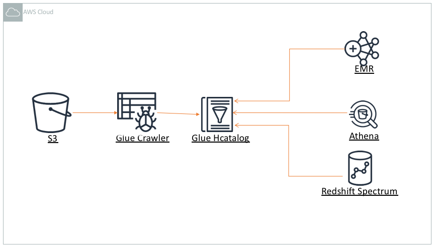
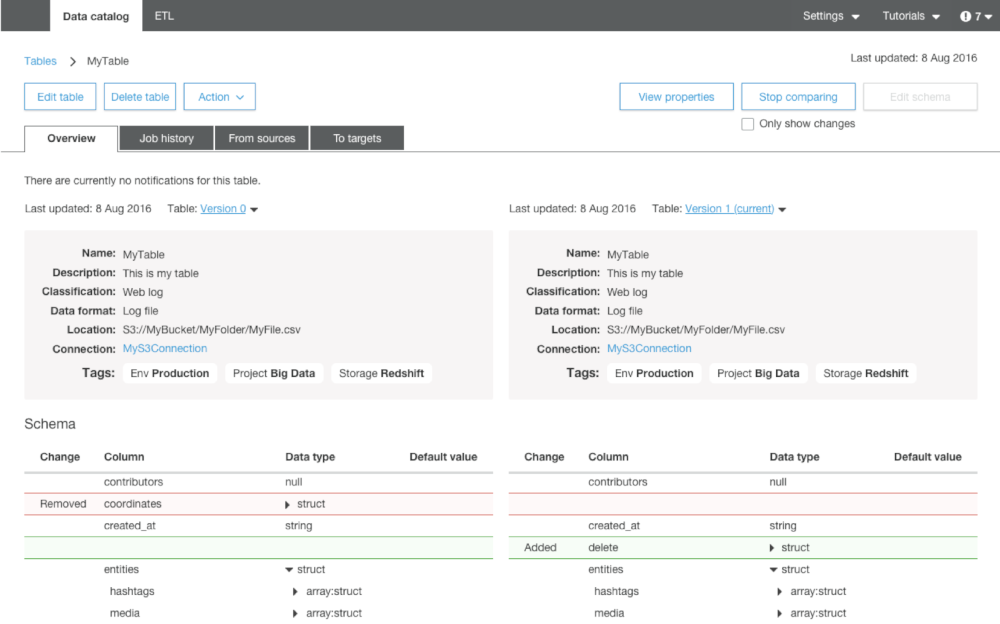

# Schema Management Within a Data Catalog

## Centralized Schema Management Architecture

Keeping track of all of the raw assets that are loaded into your datalake, and then tracking all of the new data assets and versions that are created by data transformation, data processing, and analytics can be a major challenge. An essential component of an Amazon S3 based data lake is a Data Catalog. A data catalog is designed to provide a single source of truth about the contents of the data lake, and rather than end users reasoning about storage buckets and prefixes, a data catalog lets them interact with more familiar structures of databases, tables, and partitions.

There are two general forms of a data catalog:

* Fully Managed: [AWS Glue Catalog](https://docs.aws.amazon.com/glue/latest/dg/populate-data-catalog.html)/[Amazon LakeFormation ](https://aws.amazon.com/lake-formation/)is a fully managed data catalog whose contents are generated by running crawlers over S3 datasets. The Glue Data Catalog contains information about data assets that have been transformed into formats and table definitions that are usable by analytics tools like Amazon Athena, Amazon Redshift, Amazon Redshift Spectrum, and Amazon EMR.
* End User Managed: A Hive Metastore Catalog \(HCatalog\) provides the ability to consume storage locations on Amazon S3 and on HDFS filesystems through the lanugage of databases and tables. However, it is managed and maintained by the operator of the AWS Account, and can be run through [Amazon EMR and Amazon RDS](https://docs.aws.amazon.com/emr/latest/ReleaseGuide/emr-metastore-external-hive.html). In most cases, AWS does not recommend user managed HCatalogs due to the requirement for you top operate it, as well as the need to scale the solution, and the lack of native integration with some AWS analytic tools.

Customers typically use the managed Glue Crawler to populate the catalog with the contents of Amazon S3. Then, multiple AWS services can run query the contents of the datalake via the Glue catalog.

### Schema Evolution with [AWS Glue Catalog/Amazon LakeFormation](https://aws.amazon.com/lake-formation/)

AWS Glue/Amazon LakeFormation Catalog can support datalake schema evolution, which means that it can understand the definition of a table over time, even when new columns and attributes are added.

You can read more about dealing with schemas that change over time in the [Athena user guide](https://docs.aws.amazon.com/athena/latest/ug/handling-schema-updates-chapter.html).

