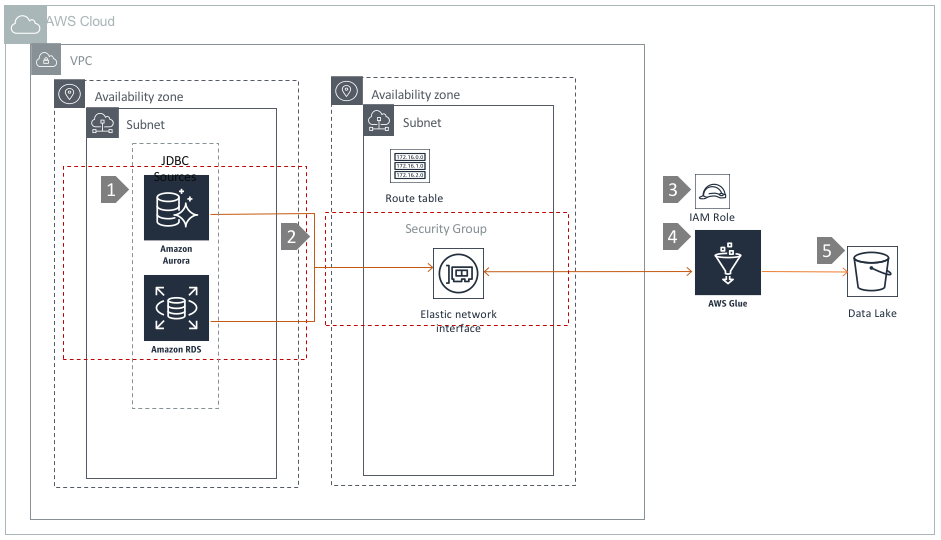

# Data Ingestion using Amazon Glue

## Overview

[AWS Glue](https://aws.amazon.com/glue/) is a fully managed extract, transform, and load \(ETL\) service that makes it easy for customers to prepare and load their data for analytics. It can extract data from heterogeneous data sources like RDBMS \(RDS, Aurora\), Amazon Redshift, or Amazon S3, and ingest it into a datalake. AWS Glue uses an Apache Spark processing engine under the hood and supports Spark APIs to transform data in memory,

In this architecture, we are using AWS Glue to extract data from relational datasources in a VPC and ingest them in to a S3 data lake backed by S3.

## Architecture Component Walkthrough

1. You create a Relational Database on [Amazon RDS](https://aws.amazon.com/rds) and/or Aurora within a VPC.
2. You [create a Connection](https://docs.aws.amazon.com/glue/latest/dg/console-connections.html) to your RDBMS in the AWS Glue Service
3. [Configure an IAM role for AWS Glue](https://docs.aws.amazon.com/glue/latest/dg/create-an-iam-role.html) that has write access to S3
4. Amazon Glue connects to the databases using JDBC through an [Elastic Network Interface\(ENI\)](https://docs.aws.amazon.com/AWSEC2/latest/UserGuide/using-eni.html) in the same VPC.
5. Data is extracted from your RDBMS by AWS Glue, and stored in Amazon S3. It is recommended to write structured data to S3 using compressed columnar format like Parquet/ORC for better query performance. Data in structured format like [CSV](https://en.wikipedia.org/wiki/Comma-separated_values) can be converted into compressed columnar format with Pyspark/Scala using spark APIs in the Glue ETL.

## References

[How to extract, transform, and load data for analytic processing using AWS Glue](https://aws.amazon.com/blogs/database/how-to-extract-transform-and-load-data-for-analytic-processing-using-aws-glue-part-2)

