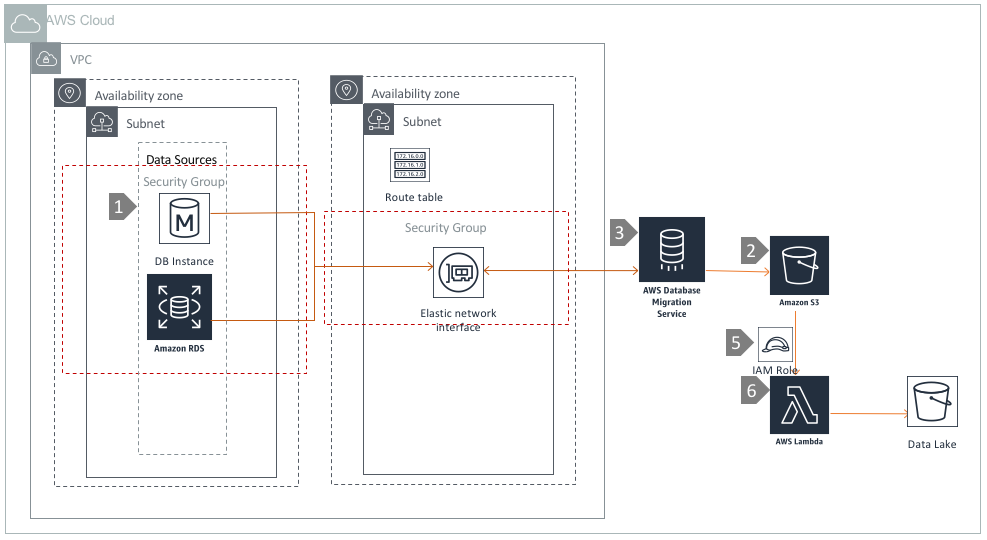

# Data Ingestion using Database Migration Service\(DMS\) and Lambda

## Overview

The [AWS Database Migration Service\(DMS\)](https://aws.amazon.com/dms/) is a managed service to migrate data into AWS. It can replicate data from operational databases and data warehouses \(on premises or AWS\) to a variety of targets, including S3 datalakes. In this architecture, DMS is used to capture changed records from relational databases on RDS or EC2 and write them into S3. [AWS Lambda](https://aws.amazon.com/lambda/), a serverless compute service, is used to transform and partition datasets based on their arrival time in S3 for better query performance.



## Architecture Component Walkthrough

1. Create a Relational databases on EC2 or RDS within a VPC.
2. Create a Staging S3 location to store changes captured by DMS.
3. [Create a Replication Instance](https://docs.aws.amazon.com/dms/latest/userguide/CHAP_GettingStarted.html#CHAP_GettingStarted.ReplicationInstance) using the DMS API's or console
4. [Specify the Source & Target Endpoints](https://docs.aws.amazon.com/dms/latest/userguide/CHAP_GettingStarted.html#CHAP_GettingStarted.Endpoints) for the Replication Instance.
5. [Create an IAM role for AWS Lambda](https://docs.aws.amazon.com/lambda/latest/dg/intro-permission-model.html) which has read access on the staging S3 bucket and write access on target datalake location.
6. [Create a Lambda function](https://docs.aws.amazon.com/lambda/latest/dg/getting-started-create-function.html) to trigger [custom code](https://github.com/maheshda-aws/aws-dbs-refarch-datalake/tree/0b08322060e9bfb0ae289065b1506dfec7a34ee3/src/data-ingestion/dms-and-lambda/staging_to_datalake_loader_lambda.py) execution with `s3:ObjectCreated:*` requests to the staging S3 bucket. The function writes the same objects to the target datalake location on S3 with partitions based on the [`LastModified`](https://docs.aws.amazon.com/AmazonS3/latest/dev/UsingMetadata.html#object-metadata) metadata attribute of S3 objects.
7. [Create a DMS Task](https://docs.aws.amazon.com/dms/latest/userguide/CHAP_Tasks.Creating.html) to migrate data from your source system to target location.
8. The DMS Replication Instance will then connect to the source via [elastic network interface\(ENI\)](https://docs.aws.amazon.com/AWSEC2/latest/UserGuide/using-eni.html), and write to the S3 staging location. AWS Lambda will receive the PutObject events, and use the [S3 Copy API](https://docs.aws.amazon.com/AmazonS3/latest/dev/CopyingObjectsExamples.html) to reorganise the data into your datalake.

### Sample Lambda Function Using Python

```python
from datetime import datetime
import boto3
import os

s3 = boto3.client('s3')
target_bucket = os.environ['TARGET_S3_BUCKET']
target_s3_prefix = os.environ['TARGET_S3_PREFIX']# Please don't use '/' at the end of TARGET_S3_PREFIX variable

def lambda_handler(event, context):

    print("Initializing S3 copy utility for DMS...")
    for object in event['Records']:
        try:
            input_bucket_name=object['s3']['bucket']['name']
            input_key = object['s3']['object']['key']
            print("Initializing copy of input file: s3://{}/{}".format(input_bucket_name, input_key))
            input_file_basename = os.path.basename(object['s3']['object']['key'])
            if target_s3_prefix is None or target_s3_prefix == '':
                partitioned_prefix = s3.head_object(Bucket=input_bucket_name,Key=input_key)['LastModified'].strftime("/year=%Y/month=%m/day=%d/hour=%H/")
            else:
                partitioned_prefix =  target_s3_prefix + s3.head_object(Bucket=input_bucket_name,Key=input_key)['LastModified'].strftime("/year=%Y/month=%m/day=%d/hour=%H/")
                #S3 headObject API is used to fetch LastModified metadata from the S3 object.
            print("Starting copy of input S3 object to s3://{}/{}/{}".format(target_bucket, partitioned_prefix, input_file_basename))
            s3.copy_object(CopySource = {'Bucket': object['s3']['bucket']['name'], 'Key': object['s3']['object']['key']}, Bucket=target_bucket, Key=partitioned_prefix + input_file_basename )
            print("S3 key was successfully copied to {}".format(target_bucket))

        except Exception as e:
            print(e)
            print('Error copying object to {}'.format(target_bucket))
            raise e
```

