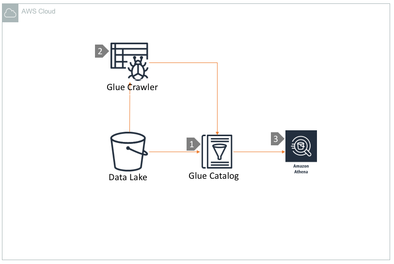

# Query S3 Data lake using Athena and Glue Catalog

## Overview
Amazon Athena is a server-less, interactive query service that makes it easy to analyze data in Amazon S3 using standard SQL. Athena is out-of-the-box integrated with AWS Glue Data Catalog, that makes it very useful to run queries against your data lake. In this architecture, we are going to explain how to leverage Athena to read data from S3 by using schema metadata from AWS Glue Catalog. Glue crawler can be optionally used to create and maintain the data catalog.

## Architecture Component Walkthrough

1. AWS Glue Catalog that stores schema and  partition metadata of  datasets residing in S3 data lake.

2. Amazon Glue Crawler can be (optionally) used to create and update the data catalogs periodically. If you know the schema of your data, you may want to use Athena to define tables directly in the Glue catalog using Hive DDL syntax.

3.  Athena can be pointed to the Glue catalog to extract schema definition and use the schema definition to query data from S3. It is recommended to use  partitions, compression and columnar data serialization format in S3 for better query performance.
