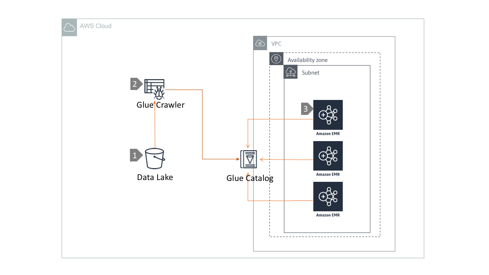

# Query Data lake using EMR and Glue Catalog

## Overview

Amazon EMR is a managed Hadoop framework in AWS. EMR is widely used by AWS customers to process vast amount of data in the cloud. EMR securely and reliably handles a broad set of big data use cases, including log analysis, web indexing, data transformations (ETL), machine learning etc.

In a datalake environment, it is essential to have a central schema repository  of the datasets available in S3. AWS Glue Catalog is one of the most popular choices among our customers for centrally managing schema. Compute engines like EMR, Athena, Redshift etc. can execute analytic wokload against the datalake .

In this architecture, we are discussing about how to leverage AWS glue catalog to be execute queries against S3 datalake using EMR.

## Architecture  Walkthrough

1. S3 datalake that gets populated by one or many data ingestion mechanism.

2.  Glue crawler is used to crawl datasets in S3 and create and maintain the schema definitions in a Glue Catalog.

3. AWS Glue Catalog is employed to create and evolve data schema.

3. Multiple EMR clusters can be deployed with access to Glue Catalog. EMR clusters can execute queries against  S3 through Internet Gateway in the VPC.
