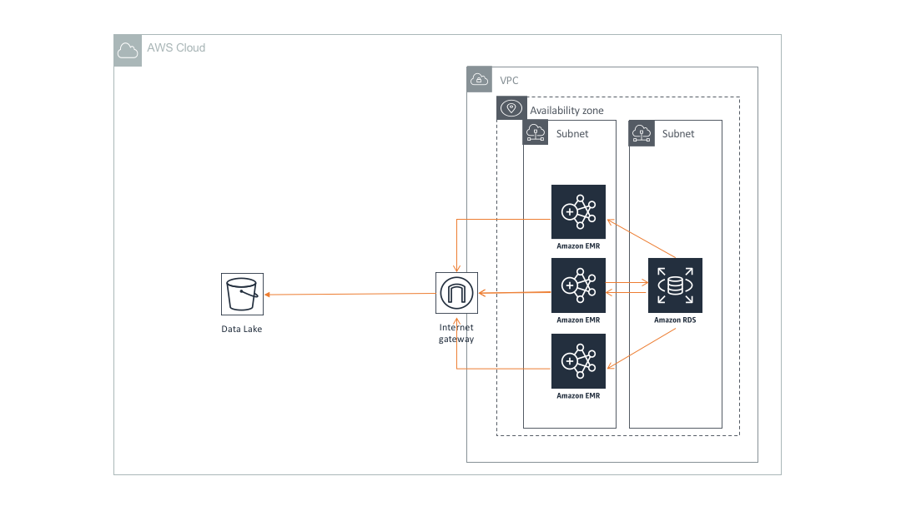

# Query Data lake using EMR and External Hive Metastore in VPC

## Overview

[Amazon EMR](https://aws.amazon.com/emr/) is a managed Hadoop framework in AWS. Hive is a data infrastructure tool to process structured/semistructured data in Hadoop using SQL like query language. Hive stores and manages schema metadata using Hive metastore service backed by a relational database. In a data lake environment, it is essential to have a centralized schema repository for other engines to access.Most of our customers leverage glue as an external catalog due to ease of use. However, customers may want to set up their own centralized catalog due to legacy reasons outlined [here](../../../README.md).

In this architecture, we will provide a walkthrough of how to set up a centralized schema repository using EMR with [RDS]()/[Aurora]() and  multiple EMR clusters can execute queries against the same schema metadata. To avoid, accidental schema  metadata loss/corruption, it is recommended that you provide database write access to one EMR cluster only.

## Architecture  Walkthrough

1. RDS database is used  to store metadata information in a VPC.

2. Single EMR Cluster is set up with Hive metastore on RDS database in same VPC but preferably in a different subnet and [security group](https://docs.aws.amazon.com/AWSEC2/latest/UserGuide/using-network-security.html). This EMR cluster would have write access on the the database. The permissions can be managed using database users.

3. Multiple EMR clusters can be deployed with read access to schema metadata on the database. Read-only EMR clusters can execute queries against the S3 using [Internet Gateway](https://docs.aws.amazon.com/vpc/latest/userguide/VPC_Internet_Gateway.html) on the VPC.

## References

* [Setting up an external database as metastore on EMR](https://docs.aws.amazon.com/emr/latest/ReleaseGuide/emr-hive-metastore-external.html)
