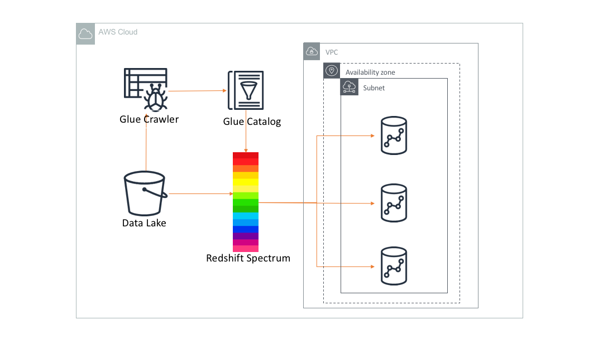

# Query Data lake using Redshift Spectrum and Glue Catalog

## Overview

Amazon Redshift Spctrum (Spectrum) is a massively parallel query engine that can run queries against your S3 data lake  without loading S3 data onto your Redshift cluster. However, for running queries using Amazon Redshift Spectrum, you need at least one Redshift cluster in your AWS Account.

Spectrum is integrated with AWS Glue Catalog. The spectrum table definition is stored in Glue Catalog and accessible to Redshift cluster through an external schema and table. In this reference architecture, we are going to explain how to leverage Amazon Redshift spectrum to query S3 data through a Redshift cluster in a VPC.

## Architecture Component Walkthrough

1. AWS Glue Catalog that stores schema and  partition metadata of  datasets residing in S3 data lake.

2. Amazon Glue Crawler can be (optionally) used to create and update the data catalogs periodically. If you know the schema of your data, you may want to use Redshift client to define Redshift external tables directly in the Glue catalog using Redshift client.

3.  You can query your data in S3 using Redshift spectrum via a S3 VPC endpoint in the same VPC. Redshift Spectrum uses the schema and partition definitions stored in Glue catalog to query S3 data. It is recommended to use compressed columnar format for better query performance.
