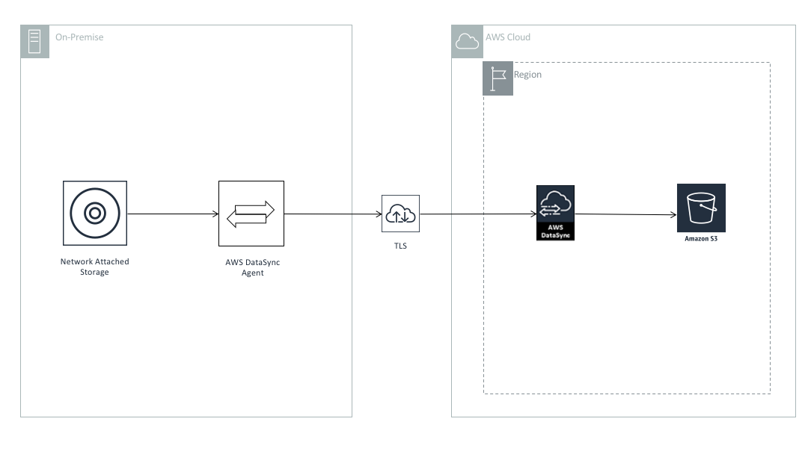

# Data Ingestion From On-Premise NFS using Amazon DataSync

## Overview

[AWS DataSync](https://aws.amazon.com/datasync/) is a fully managed data transfer service that simplifies, automates, and accelerates moving and replicating data between on-premises storage systems and AWS storage services over the internet or AWS Direct Connect. In a datalake environment, AWS DataSync can be used to sync files securely from on premise storage servers like NFS to S3 based datalake automatically.

In this architecture, we = walk you through how to use AWS DataSync and DataSync Agent to migrate data to a datalake in Amazon S3.

## Architecture Component Walkthrough

1. You create a network attached file storage server (NFS) inside your data center.
2. You [install an AWS Datasync Agent](https://docs.aws.amazon.com/datasync/latest/userguide/create-agent-cli.html) as a VMware ESXi [hypervisor](https://en.wikipedia.org/wiki/Hypervisor) based environment. This Agent will have read access on the NFS server.
3. You configure AWS DataSync with the [locations](https://docs.aws.amazon.com/datasync/latest/userguide/create-locations-cli.html) required to perform syncronisation
3. You [create](https://docs.aws.amazon.com/datasync/latest/userguide/create-task-cli.html) and then [start](https://docs.aws.amazon.com/datasync/latest/userguide/start-task-execution.html) an AWS DataSync task to synchronization files from NFS to S3.
4. Use an [AWS Glue Crawler](https://docs.aws.amazon.com/glue/latest/dg/add-crawler.html) to catalog the S3 location that receives files via AWS DataSync.

## References

* [Getting started with AWS DataSync](https://docs.aws.amazon.com/datasync/latest/userguide/getting-started.html)
* [How AWS DataSync works](https://docs.aws.amazon.com/datasync/latest/userguide/how-datasync-works.html)
