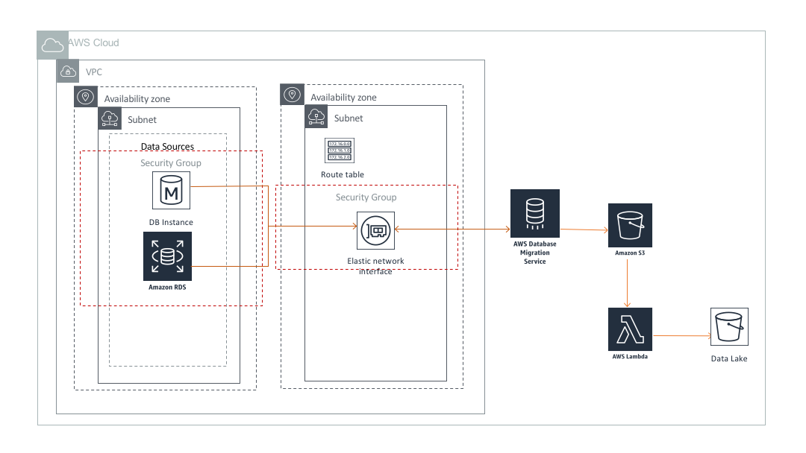

# Data Ingestion using Database Migration Service(DMS) and Lambda

## Overview

[AWS database migration service(DMS)](https://aws.amazon.com/dms/) is a managed service to migrate data into AWS. It can replicate data from operational databases and data warehouses (on premise or AWS) to S3. In this architecture DMS is used to capture changed record stream from relational databases on RDS or EC2 in a VPC and write them into S3. [Lambda](https://aws.amazon.com/lambda/), a serverless managed service, is leveraged to transform and partition datasets based on their arrival time in S3 for better query performance.



## Architecture Component Walkthrough

1. Relational databases on EC2 or RDS within a VPC.

2. AWS database management service that can connect to the relational databases via [elastic network interface(ENI)](https://docs.aws.amazon.com/AWSEC2/latest/UserGuide/using-eni.html).

3. Staging S3 bucket to store changes captured by DMS.

4. Lambda function to trigger custom code execution with putObject request on staging S3 bucket. The function writes the same objects to target datalake on S3 with partitions based on ```last_modified_timestamp``` of S3 objects.

5. IAM role for  Lambda function having read access on staging S3 bucket and write access on target datalake.
