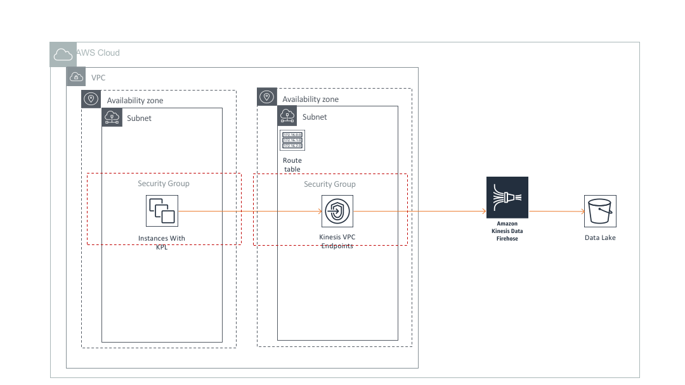

# Data Ingestion using Kinesis Firehose and Kinesis Producer Library (KPL)

## Overview
[Amazon Kinesis](https://aws.amazon.com/kinesis/) makes it easy to collect, process, and analyze real-time, streaming data so you can get timely insights and react quickly to new information. Amazon Kinesis offers key capabilities to cost-effectively process streaming data at any scale, along with the flexibility to choose the tools that best suit the requirements of your application.

[Kinesis Data Firehose](https://aws.amazon.com/kinesis/data-firehose/) is fully managed service that [delivers data to target locations](https://docs.aws.amazon.com/firehose/latest/dev/basic-deliver.html) including Amazon S3, Redshift, and the ElasticSearch Service. The [Kinesis Producer Library (KPL)](https://github.com/awslabs/amazon-kinesis-producer) simplifies producer application development, allowing developers to achieve high write throughput to a Kinesis Data Stream. In this example, KPL is used to write data to a Kinesis Data Stream from the producer application. Kinesis Firehose then reads this stream and batches incoming records into files and delivers them to S3 based on file buffer size/time limit defined in the Firehose configuration.

## Architecture Component Walkthrough

1. Your application [uses the Kinesis Producer Library](https://docs.aws.amazon.com/streams/latest/dev/developing-producers-with-kpl.html) to collect records and write to Kinesis Data Streams.
2. If your application resides in VPC, you can use an Internet Gateway or a [Kinesis VPC Endpoint](https://docs.aws.amazon.com/streams/latest/dev/vpc.html) to access the Kinesis Service.
2. Kinesis Firehose is [configured to read data from the Kinesis Data Stream](https://docs.aws.amazon.com/firehose/latest/dev/writing-with-kinesis-streams.html)
3. Firehose batches records based on count or target file size, and then compresses and encrypts files before delivering to S3