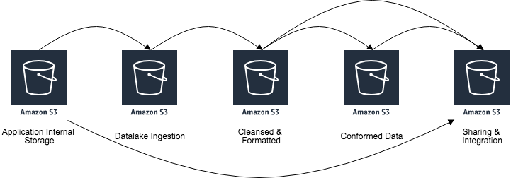
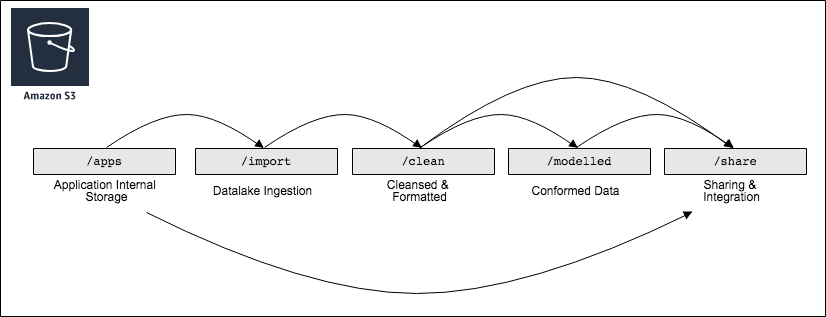
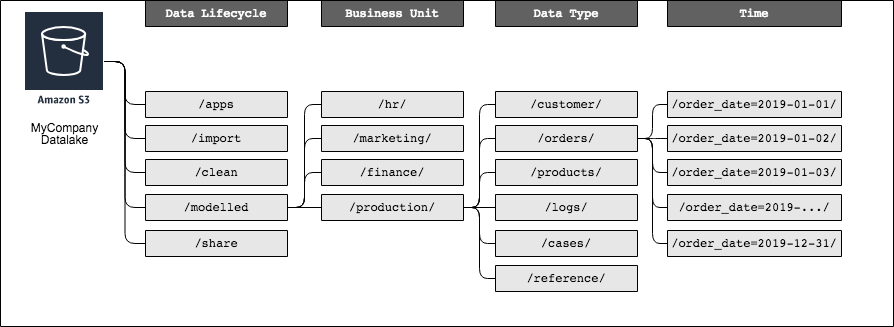

# Datalake Storage Foundation Architecture

[Amazon Simple Storage Service \(Amazon S3\)](https://aws.amazon.com/s3) is an object storage service that offers industry-leading scalability, data availability, security, and performance. This means customers of all sizes and industries can use it to store and protect any amount of data for a range of use cases, such as websites, mobile applications, backup and restore, archive, enterprise applications, IoT devices, and big data analytics. Amazon S3 provides easy-to-use management features so you can organize your data and configure finely-tuned access controls to meet your specific business, organizational, and compliance requirements. Amazon S3 is designed for 99.999999999% \(11 9's\) of durability, and stores data for millions of applications for companies all around the world.

Amazon S3 provides the ideal datalake storage foundation by offering a highly scalable, durable, and secure environment for any type of data. It is strongly integrated with identity services in IAM, encryption services from KMS, and both internal AWS as well as third-party analytic services natively integrate with its API's.

## S3 Storage Definitions

* **Region**: Amazon cloud computing resources are hosted in multiple locations world-wide. These locations are composed of AWS [Regions](https://docs.aws.amazon.com/AmazonRDS/latest/UserGuide/Concepts.RegionsAndAvailabilityZones.html) and Availability Zones. Each AWS Region is a separate geographic area. Each AWS Region has multiple, isolated locations known as Availability Zones.
* **Bucket**: Amazon S3 organises data into Buckets, which are created in a Region and which can have security Plicies applied to Bucket contents which dictate which users, roles, and behaviours are applied. A single AWS Account can have 1000 buckets _\(Q1 2019\)_
* **Object**: Amazon S3 stores objects, which for most customers are Files, but which can be any type of data. Objects are stored at a Prefix, which provides them with a unique URL. Objects have a name, as well as metadata and tags associated with them.
* **Prefix**: '/' \(Slash\) delimited path where an Object is stored within the Bucket. The combination of the Bucket Name, Prefix, and Object Name uniquely identify the Object globally
* **Bucket Policy**: S3 can store security Policies in the form of JSON documents which allow you to control which users and roles can access the bucket, and how, as well as setting requirements for how data is stored in the Bucket \(for example requiring encryption\).

## Designing your Datalake

Amazon S3 provides you a simple and powerful mechanism for organising your data in a Region through Buckets and Prefixes. When designing your Datalake, you need to carefully design how data should be laid out in S3, and consider how multiple Regions data will need to interact. Typically it's considered a best practice for a global datalake to lay out data in the same way regardless of Region.

### How many Buckets do you need?

Depending on your requirements, it's entirely possible to build an enterprise grade datalake using just a single S3 Bucket. Alternatively, you may find that you require multiple Buckets to implement your datalake's security and governance policies.

In general, you should only create new Buckets for your datalake when you need to deeply segment your security policies. [S3 Bucket Policies](https://docs.aws.amazon.com/AmazonS3/latest/dev/using-iam-policies.html) provide you an expressive way to manage security across a large number of prefixes. With a single Bucket, if you have very complex security and access requirements, you may find that having a single Bucket Policy will become hard to maintain. In this case, you may have a low number of Buckets each with their own smaller, manageable policies. Your requirements may differ, but it is unlikely that you will require more than 10 Buckets to implement an extremely robust security model for your datalake.

Most customers find that they have differing security requirements based upon the lifecycle of the data being managed. We often see that customers ingest data and progress it through a series of transformations, that take it from raw application formatted data, to finally being strongly govered and conformed to a set of business terms, like it would be in an Enterprise Data Warehouse. Given this model, you may wish to have separate buckets and security policies for:

* **Application internal storage** - allowing your applications to store whatever they require
* **Datalake ingestion locations** - where applications place data for ingestion into the datalake
* **Cleansed and format conformed data** - where compression, encryption, and prefix has been standardised
* **Strongly modelled data** - fit for loading into an Enterprise Data Warehouse or for building financial reports
* **Sharing locations** - where your internal customers can create obfuscated, tokenised, anonymised, or subset datasets for sharing internally or with third-parties

Alternatively, you may find that all of your datalake lifecycle locations can be managed through prefixes alone.

### What should your Prefixes look like?

If you use the second option, or in your Cleansed and Conformed storage Buckets, you should carefully design the prefix structure to support the required security and data separation model. For the rest of this guide, we'll assume that you are using a single S3 Bucket for everything in the datalake, which as pictured above makes the first level of the prefix the 'lifecycle' stage of the data.

The second level of ownership is typically around business units, in that while data is shared within your datalake, it should also be owned by someone, and this information filters into the prefix layout and security model appleid to the data. You should also consider that while datalakes support unstructured and semi-structured data, analytical and data exploration tools in the Hadoop and Spark ecosystem, via a Data Catalog, typically expect to find data of similar structure stored at the same location. Finally, these same tools support partitioning based upon the value of attributes of the data, and this can significantly improve performance for your analytical users.

For shared Buckets, this results in a best practice of having a prefix hierarchy for your datalake such as:

1. **Lifecycle Stage** - the name of the stage of the data, such as `apps` for application storage, or `import` for ingestion.
2. **Application Owner** - the name of the business unit or steward for the data. This value should be decided up front, and have a relatively low cardinality, like `hr`, `marketing`, or `finance`.
3. **Data Type** - for all conformed data, this would represent the strongly typed name of the data, such as `customer`, or `orders`
4. **Time** - it is extremely common, expecially for prefixes that include a very large amount of data, to partition the storage prefixes by a notion of time. See the next section for more details.

You may also choose to introduce a prefix for collections of data under the Application Owner, such as `logs`, or on the basis of an application name. Furthermore, you may choose to implement the concept of schemas and databases above the level of Data Type. In either case, you should consider these to be concepts that are applied to all the data on the basis of the top level prefix \(data lifecycle\), and this storage policy should be mandated and governed across the system.

### Designing Time Based Partitioning

As mentioned above, for large datasets you should implement time based partitioning. This offers a nice general navigation mechanism, as well as reduce the amount of data that must be `list`ed before you can access a set of files. This can significantly improve performance for query users and reduce cost.

In nearly all cases, you should implement partitioning at the month level, but you may also find daily granuarlity to be helpful. Very large datasets where you typically only look at very recent data can be further partitioned by Hour, but it's rarely beneficial to partition by Minute or Second. By understanding the timeframe of queries typically executed against the storage location, you can choose the right granularity for your prefixes. Keep in mind that regardless of what your partitioning structure is in the prefixes, you will still capture all the data. It just means that you will potentially create more files, that allow you to be more selective about the timeframe you are accessing when data is read.

#### Static vs Dynamic Partition Values

The structure of the value used for time based partitioning is very important, in that it can dictate how you operate your data lake. There are two main approaches to managing these partitions:

* [**Dynamic Partitioning**](https://cwiki.apache.org/confluence/display/Hive/LanguageManual+DDL#LanguageManualDDL-DynamicPartitions): In this model, you take advantage of a convention build into most Hive compatible metastore/data catalogs, that by marking up your partitioning values in a specific way, that the partitions can be automatically imported and resolved. This is the simplest model to work with, and requires that you store your partition prefixes in the form of `partition attribute`=`partition value`. For example, an order date would be stored with the prefix value of `order_date=<SomeDateValue>`
* **Static Partitioning**: In this model, you name prefixes in whatever way you see fit for the application, but then are required to add the partitions manually to your data catalog. For example, you could store the data for January of 2019 in partition `Jan2019`, but then change part way through and put Feburary in `2019-02`. You then issue the commands `alter table mytable add partition (month='jan', year='2019') location 's3://mybucket/prefix/Jan2019';` and `alter table mytable add partition (month='feb', year='2019') location 's3://mybucket/prefix/2019-02';`

We highly recommend that customers use Dynamic Partitioning wherever possible, as it greatly simplifies operations for your data catalog. When you use this format, partitions are automatically and always included in queries, and can be manually added using the command `msck repair table <mytable>;`.

#### Flat vs Hierarchical Partitions

You must consider what your partitioning items will be for a given data type. There are two main approaches that are typically used for time based partitions, and like with the granularity of the partitions should be decided based on how you think end users want to work with the data:

**Flat Dates**

In this model, date values that meet the granularity of the partitioning scheme are stored as simple strings. The strings are almost certainly formatted in order of `YEAR MONTH DAY HOUR`, for example `YYYY-MM-DD HH24`, so as to support string based comparisons including `BETWEEN, GREATER THAN, LESS THAN, etc` that correctly sort using only ASCII characters. In this case, you will typically store the full date value, but truncate it down to the granularity of the partition - with monthly partitioning, data for January 1st, 1970 at 9am will be stored as `1970-01-01 00` \(at midnight\), and the hourly granularity is truncated. When combined with dynamic partitioning, this would result in a prefix of `order_date=1970-01-01 00`.

This model can be much simpler for end users to work with, and they can use simple date expressions on a single `DATE` type attributes through the catalog.

**Hierarchical Dates**

Instead of using flat string dates, you can implement a date hierarchy in your data catalog. This means that Year, Month, Day and Hour are stored as separate prefixes, and modelled as attributes that are `INT` type in your catalog. In this case, you have a separate prefix for each component of the date. Monthly data parititons for January 1st 1970 would be stored in prefix `year=1970/month=01/day=01`, for example.

This model provides simplicity for end users that query across multiple time dimensions with different types of queries \(such as week-on-week or month-on-month analysis\), but makes it more complicated for end users who want to perform equality operations on date values: using a sql based tool, instead of looking at a short date range as `where date_attribute between x and y`, they must instead create a where clause of `where year = ? and month = ? and day between x and y`. End users must know that they have to chop up their date range in this way, and also must know which attributes to use for the date comparison.

#### Natural Dates vs System Dates

The last part of a time based partitioning design is to ensure that the date values used for prefix based partitioning are things that your end users care about, rather than values that were injected by the system. For example, consider a system that takes orders. When a customer places the order, the application may log this to a Kinesis Data Stream. The Order record that is put onto the Stream will of course include the `order_date` value, which is the time that the application accepted the order and which the customer will see. When this data flows through into your data lake, for example via Kinesis Firehose, it will be placed into S3 using a prefix structure of [YYYY/MM/DD/HH](https://aws.amazon.com/kinesis/data-firehose/faqs), with the time values based on the **Delivery Time**. This is not the `order_date` from the data record, and your final table in the Glue Data Catalog will contain separate Year, Month, Day, Hour and `order_date` attributes, unless you manually create partitions at the granularity you require. If you allow Glue Data Catalog Crawlers to process these prefixes, then separate attributes will be created in your table. Crucially, when your end users use SQL to query dates as `where order_date between x and y`, **no S3 based prefix partition elimination will occur**, because the query isn't going against the values from the partition columns.

If your system exhibits your behaviour, then you should consider the location written by Kinesis Firehose to be that of an 'import' location, and use AWS Glue or AWS Lambda to process these new partitions, and within the processing job apply new partitioning based on `order_date`, storing the values into the conformed data top level prefix.

## Overview of Datalake Storage Structure

January 3rd, 2019's Orders will be found at:

`s3://datalake/modelled/production/orders/order_data=2019-01-03/...`

